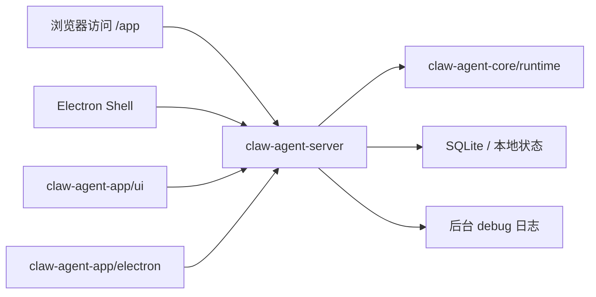

# ClawAgent App 开发计划

## 1. 目标

构建一个面向个人本地使用的 ClawAgent App，形态类似 Trae Solo、Codex Desktop：

- 后端继续复用 `claw-agent-server` 作为统一服务入口。
- 前端重新设计为个人 App 工作台，不复用现有后端管理页面。
- Spring Boot 托管 `/app` 静态资源。
- Electron 和浏览器访问同一个本地 URL：`http://127.0.0.1:{port}/app/`。
- App 专属接口统一放在 `/api/v1/app`。
- 通用能力继续使用现有 `/api/v1` 接口，避免重复造一套接口。

## 2. 命名约定

- 产品形态：`ClawAgent App`
- 前端/Electron 项目目录：`claw-agent-app`
- Spring Boot 静态资源路径：`/app`
- App 专属后端接口：`/api/v1/app`
- 不使用 `/desktop` 作为静态资源路径或接口路径。

## 3. 总体架构

运行方式：

- 浏览器模式：用户启动 `claw-agent-server` 后访问 `/app/`。
- App 模式：Electron 自动启动本地 `claw-agent-server`，窗口加载 `/app/`。
- 两种模式使用同一套 UI、同一套接口、同一个本地服务地址。

## 4. 模块划分

### 4.1 `claw-agent-server`

职责：

- 作为 App 后端入口。
- 托管 `/app` 静态资源。
- 提供 `/api/v1/app` App 专属接口。
- 继续提供已有 `/api/v1` 通用接口。
- 管理 workspace、session、task、日志、能力开关。

原则：

- 前后端通用接口保持不变，后续仍在原接口中演进。
- App 特有能力放到 `/api/v1/app`。
- 如果新接口同时对 admin UI 有价值，优先放到通用 `/api/v1`。
- `/api/v1/app` 做 App 适配时不能破坏 admin UI 兼容性。

### 4.2 `claw-agent-app/ui`

职责：

- 新设计个人 App UI。
- 支持浏览器直接访问。
- 支持 Electron 内嵌访问。
- 不复用现有后端管理 UI。

核心页面：

- 新会话页：选择 workspace、模型、权限、执行模式。
- 会话页：展示流式输出、Todo、工具调用、文件变更、后台日志入口。
- 项目页：展示最近 workspace、当前分支、本地状态。
- 日志页：查看 debug 日志、导出诊断包。
- 设置页：配置模型、服务地址、本地能力、日志级别。

### 4.3 `claw-agent-app/electron`

职责：

- 启动和守护本地 `claw-agent-server`。
- 健康检查后打开窗口。
- 加载 `http://127.0.0.1:{port}/app/`。
- 提供系统增强能力，例如打开目录、显示文件、打开日志目录。
- 退出时清理由 App 启动的 server 子进程。

不负责：

- 不实现业务逻辑。
- 不绕过后端直接操作核心 Agent。
- 不单独维护一套 UI。

## 5. Workspace 与 Session 设计

支持每个会话开始时选择不同 workspace。

规则：

- workspace 是 session 的启动上下文，不只是全局默认值。
- 创建 session 时写入 `workspaceId`、`workspaceName`、`workspaceRoot`。
- task 从 session 继承 workspace 快照。
- 切换默认 workspace 不影响已有 session。
- 最近 workspace 用于快速选择，不代表所有会话都自动迁移。

接口：

- `POST /api/v1/app/workspaces/open`：打开或登记一个本地 workspace。
- `GET /api/v1/app/workspaces/recent`：获取最近 workspace。
- `POST /api/v1/app/workspaces/switch`：切换默认 workspace。
- `GET /api/v1/app/workspaces/current`：获取当前默认 workspace。

通用接口适配：

- `POST /api/v1/sessions` 支持传入 `workspaceId`。
- `POST /api/v1/tasks` 支持从 session 继承 workspace。
- `POST /api/v1/tasks/stream` 支持从 session 继承 workspace。

## 6. App 专属接口规划

### 6.1 运行时

- `GET /api/v1/app/runtime`

含义：

- 返回当前运行模式：`server` 或 `app`。
- 返回服务端口、静态资源地址、日志目录、数据目录。
- UI 用它判断当前是在浏览器模式还是 Electron App 模式。

### 6.2 能力开关

- `GET /api/v1/app/capabilities`

含义：

- 返回当前环境支持哪些能力。
- App 模式可以支持本地路径打开、日志目录打开、文件 reveal。
- Server 模式必须禁用危险本地能力。

### 6.3 Workspace

- `POST /api/v1/app/workspaces/open`
- `GET /api/v1/app/workspaces/recent`
- `POST /api/v1/app/workspaces/switch`
- `GET /api/v1/app/workspaces/current`

含义：

- 管理本地项目列表。
- 支持新会话绑定 workspace。
- 支持最近项目和默认项目。

### 6.4 系统能力

- `POST /api/v1/app/system/open-path`
- `POST /api/v1/app/system/reveal-path`
- `POST /api/v1/app/system/reveal-log-dir`

含义：

- 打开路径。
- 在系统文件管理器中定位文件。
- 打开日志目录。

限制：

- 只在 App 模式开放。
- Server 模式返回不可用，避免浏览器远程访问带来本地路径风险。

## 7. 日志与 Debug

桌面 App 必须支持查看后台 debug 日志。

通用日志接口：

- `GET /api/v1/logs/query`：查询历史日志。
- `GET /api/v1/logs/tail`：实时推送日志。
- `POST /api/v1/logs/export`：导出诊断包。
- `POST /api/v1/client-errors`：接收前端错误日志。

安全要求：

- 日志导出不能包含密钥、token、完整敏感配置。
- 默认只导出最近日志片段和运行摘要。
- 敏感字段需要脱敏后再写入诊断包。

UI 要求：

- 会话页能快速打开当前任务相关日志。
- 日志页支持按级别、时间、关键词过滤。
- Electron App 支持一键打开日志目录。
- 浏览器模式只能看后端暴露的日志接口，不能直接打开本地目录。

## 8. 安全边界

运行模式：

- `server`：普通后端服务模式。
- `app`：本地 App 模式，由 Electron 启动或显式配置。

安全策略：

- `server` 模式禁用本地路径打开、日志目录打开、终端等 App 能力。
- `app` 模式只允许操作已登记 workspace 和受控日志目录。
- 路径操作必须做规范化和越权检查。
- 前端不能假定自己拥有本地权限，必须以 `/api/v1/app/capabilities` 为准。

## 9. 打包方案

构建链路：

1. `claw-agent-app/ui` 构建静态资源。
2. 静态资源输出到 `claw-agent-server/src/main/resources/static/app`。
3. Maven 打包 `claw-agent-server` 可执行 jar。
4. `jlink` 基于 JDK 17 生成精简 Java runtime。
5. Electron Builder 将 jar、Java runtime、Electron Shell、运行脚本打包成 Windows 安装包或免安装目录。

App 启动流程：

1. Electron 查找可用本地端口。
2. Electron 优先使用内置 `runtime/java17/bin/java.exe` 启动 `claw-agent-server.jar`。
3. Electron 轮询 `/actuator/health` 或 `/api/v1/app/runtime`。
4. 健康检查通过后加载 `http://127.0.0.1:{port}/app/`。
5. 退出 App 时清理由 Electron 启动的 server 子进程。

Java runtime 策略：

- 发布版必须内置 Java 17 runtime，不能要求普通用户预装 Java。
- 默认内置 `jlink` 精简 runtime，不内置完整 JDK。
- 如果未来需要在 App 内执行 `javac`、Maven 或 Gradle，再支持配置外部 JDK。

数据目录策略：

- Electron 启动 server 时必须显式传入可写 SQLite 路径。
- 发布版数据写入 Electron `userData/data/clawagent.db`。
- 发布版日志写入 Electron `userData/logs/clawagent.log`。
- 不把运行数据写入安装目录，也不依赖当前工作目录下的 `.clawagent`。

浏览器访问流程：

1. 用户手动启动 `claw-agent-server`。
2. 浏览器访问 `http://127.0.0.1:{port}/app/`。
3. UI 根据 `/api/v1/app/runtime` 和 `/api/v1/app/capabilities` 降级不可用能力。

## 10. 开发阶段

### 阶段一：后端 App 基础能力

- 增加 `clawagent.mode` 配置。
- 增加 `/api/v1/app/runtime`。
- 增加 `/api/v1/app/capabilities`。
- 增加 workspace 管理服务。
- session 创建支持绑定 workspace。
- task 执行继承 session workspace。

验收：

- 可以通过接口登记 workspace。
- 可以创建绑定 workspace 的 session。
- 切换默认 workspace 不影响已有 session。

### 阶段二：日志与诊断

- 增加历史日志查询。
- 增加实时日志 tail。
- 增加诊断包导出。
- 增加前端错误上报。

验收：

- `/api/v1/logs/query` 可查历史 debug 日志。
- `/api/v1/logs/tail` 可实时推送日志。
- `/api/v1/logs/export` 不包含密钥、token、完整敏感配置。

### 阶段三：App UI

- 新建 `claw-agent-app/ui`。
- 实现新会话 workspace 选择。
- 实现流式输出。
- 实现 Todo、工具调用、文件变更展示。
- 实现日志入口。

验收：

- 前端可以选择 workspace 创建新会话。
- 可以提交任务并展示流式输出。
- 可以展示 Todo、工具调用、文件变更和后台日志。
- 浏览器可以直接访问 `/app/`。

### 阶段四：Electron Shell

- 新建 `claw-agent-app/electron`。
- 实现自动启动 server。
- 实现健康检查。
- 实现加载 `/app/`。
- 实现退出清理子进程。
- 实现 App 模式系统能力。

验收：

- Electron 能自动启动 server。
- Electron 能打开窗口并加载 `/app/`。
- 浏览器能访问同一个本地地址。
- 退出 App 后清理子进程。

### 阶段五：打包与发布

- Maven 打包 server jar。
- Vite 构建 UI 静态资源。
- Electron Builder 打包 Windows 安装包。
- 整理日志目录、数据目录、配置目录。

验收：

- 产出 Windows 可安装包或免安装包。
- 安装后可直接打开 ClawAgent App。
- App 和浏览器访问同一后端 URL。

## 11. 最小可用版本范围

MVP 必须包含：

- `/app/` 新 UI。
- `/api/v1/app/runtime`。
- `/api/v1/app/capabilities`。
- workspace 打开、最近列表、当前 workspace。
- session 创建时绑定 workspace。
- task 流式执行。
- debug 日志查看。
- Electron 自动启动 server。
- 浏览器访问同一个本地 URL。

MVP 暂不强制包含：

- 插件市场。
- 多账号系统。
- 云同步。
- 自动更新。
- 跨设备协作。

## 12. 关键验收清单

- Workspace：验证每个 session 可以选择不同 workspace。
- Workspace：验证切换默认 workspace 不影响已有 session。
- 日志：验证 `/api/v1/logs/query` 查历史 debug 日志。
- 日志：验证 `/api/v1/logs/tail` 实时推送日志。
- 日志：验证 `/api/v1/logs/export` 不包含密钥、token、完整敏感配置。
- 前端：验证新会话选择 workspace、提交任务、展示流式输出、Todo、工具调用、文件变更和后台日志。
- Electron：验证自动启动 server、健康检查、打开窗口、浏览器访问同一地址、退出清理子进程。
- 安全：验证 server 模式下本地路径打开、日志目录打开、终端等 App 能力不可用。
